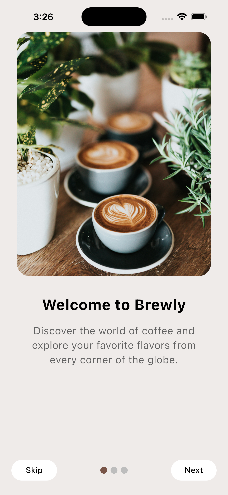
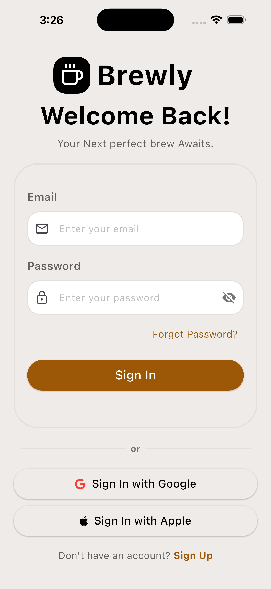
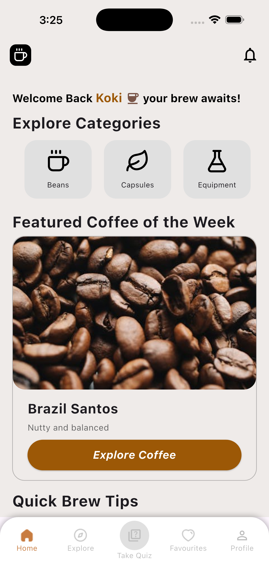
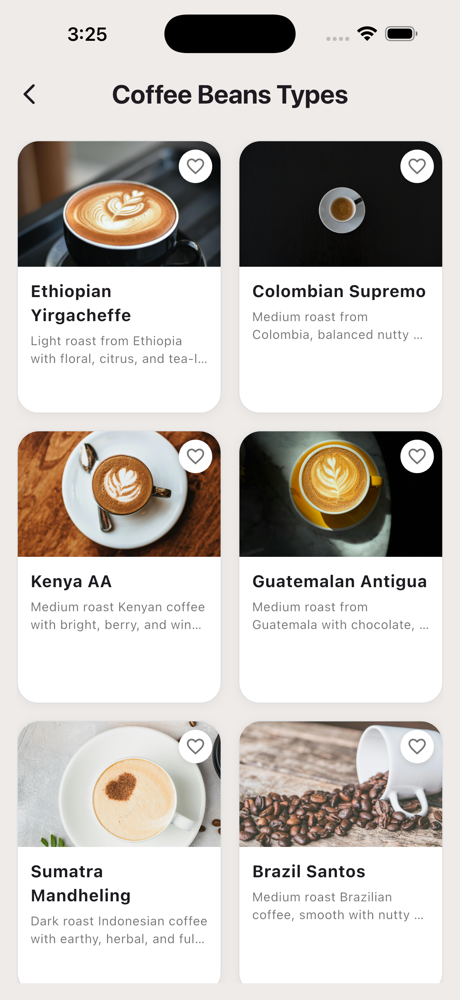
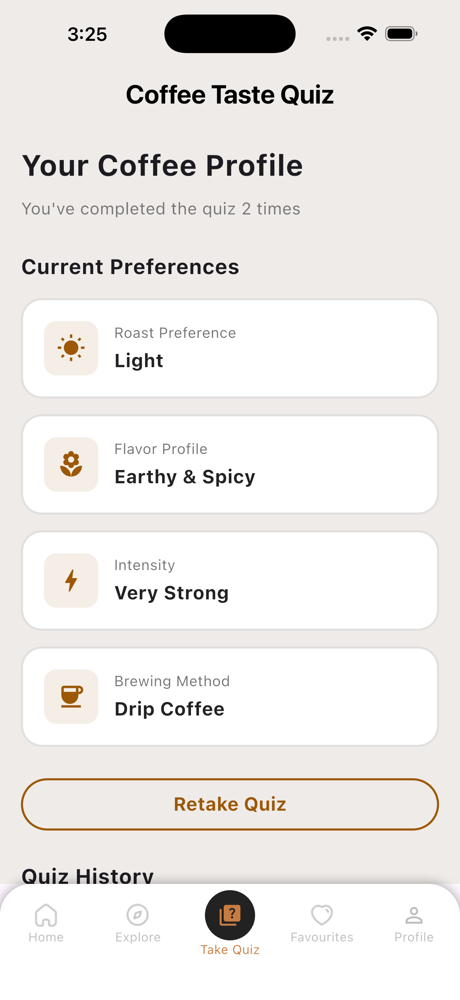
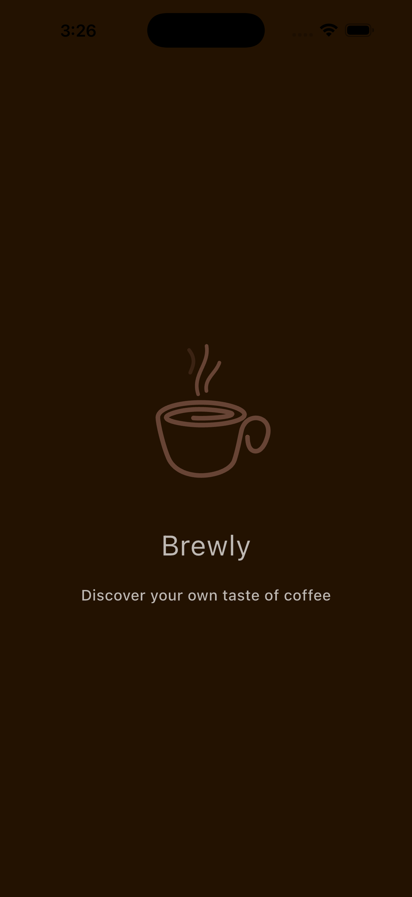
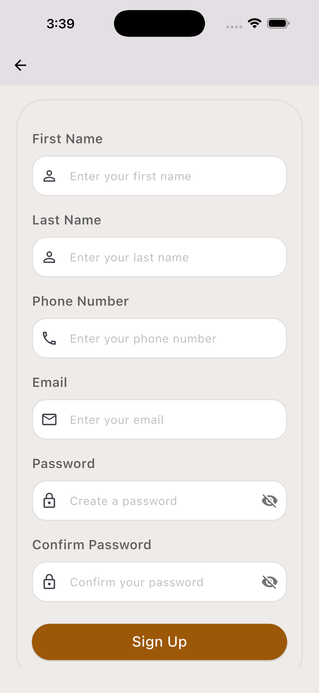
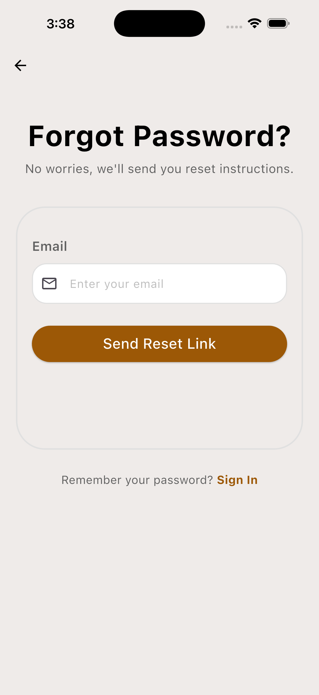
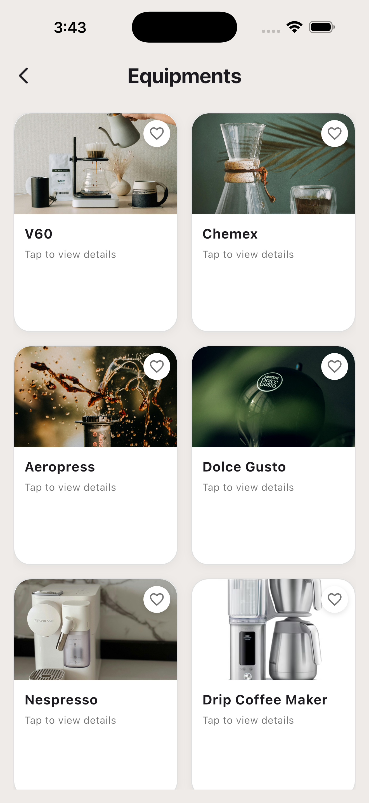
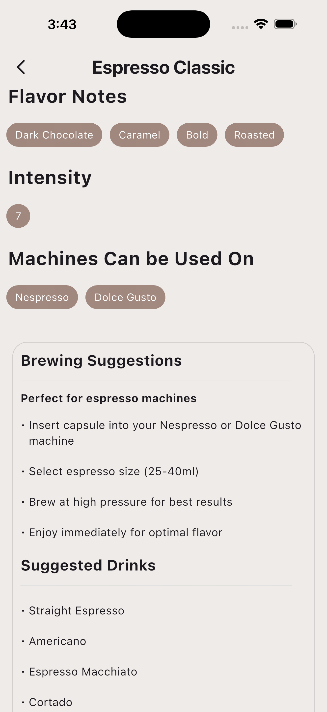

# ☕ Brewly - Your Personal Coffee Companion

<div align="center">


**Discover, Track, and Perfect Your Coffee Journey**

[](https://flutter.dev)
[](https://dart.dev)
[](https://supabase.com)
[](LICENSE)

[Features](#-features) • [Screenshots](#-screenshots) • [Installation](#-getting-started) • [Architecture](#-project-structure) • [Contributing](#-contributing)

</div>

---

## 📖 About Brewly

**Brewly** is a comprehensive mobile application designed for coffee enthusiasts who want to explore, discover, and perfect their coffee experience. Whether you're a casual coffee drinker or a dedicated connoisseur, Brewly helps you track your favorite brews, discover new coffee varieties, and connect with coffee culture around the world.

### 🎯 Mission

To create a personalized coffee journey that combines discovery, education, and community, making every cup of coffee a memorable experience.

---

## ✨ Features

### 🔐 **Authentication & User Management**
- **Secure Sign In/Sign Up** with email and password
- **Google OAuth Integration** for quick access
- **Password Recovery** via email
- **Profile Management** with photo upload
- **Personalized Greetings** with user's first name

### 🎨 **Coffee Discovery**
- **Coffee Beans Explorer** - Discover 13+ varieties from around the world
  - Ethiopian Yirgacheffe, Colombian Supremo, Kenya AA, and more
  - Detailed flavor profiles, brewing methods, and origins
- **Coffee Capsules** - 15+ capsule varieties for different machines
  - Compatible with Nespresso, Dolce Gusto
  - Intensity ratings and flavor notes
- **Equipment Guide** - Learn about 9 brewing methods
  - V60, Chemex, Aeropress, French Press, and more
  - Direct links to purchase equipment

### 🌍 **Global Coffee Exploration**
- **15+ Coffee-Producing Countries** featured
- **Famous Coffee Varieties** from each region
- **Local Café Recommendations** with direct links
- **Cultural Coffee Insights** and flavor profiles

### 🧠 **Personalized Experience**
- **Coffee Taste Quiz** - 4-question assessment
  - Roast preference (Light, Medium, Dark)
  - Flavor profile preferences
  - Intensity level
  - Preferred brewing method
- **"Show My Taste" Filter** - AI-powered recommendations
- **Quiz History Tracking** - Multiple attempts saved
- **Retake Anytime** - Update preferences as tastes evolve

### ❤️ **Favorites System**
- **User-Specific Favorites** - Isolated per account
- **Multi-Category Support** - Beans, Capsules, Countries, Equipment
- **Persistent Storage** - Never lose your favorites
- **Quick Access** - View all favorites in one place

### 🏠 **Beautiful UI/UX**
- **Modern Material Design** with brown coffee theme
- **Smooth Animations** using flutter_animate
- **Responsive Layout** - Adapts to all screen sizes
- **Intuitive Navigation** - Bottom navigation bar
- **Beautiful Typography** - Carefully selected fonts

---

## 📱 Screenshots

<div align="center">

| Onboarding | Sign In | Home Screen |
|:----------:|:-------:|:-----------:|
|  |  |  |

| Coffee Beans | Quiz | Profile |
|:------------:|:----:|:-------:|
|  |  |  |


| Splash | Sign up | Forget Password | 
|:----------:|:-------:|:-----------:|
|  |  |  |


| Equipment | details | 
|:----------:|:-------:|
|  |  | 

</div>

---

## 🛠️ Tech Stack

### **Frontend**
- **Flutter 3.0+** - Cross-platform UI framework
- **Dart 3.0+** - Programming language
- **flutter_bloc 8.1+** - State management
- **flutter_animate** - Animations
- **flutter_svg** - SVG rendering
- **image_picker** - Photo selection

### **Backend & Services**
- **Supabase** - Backend as a Service
  - Authentication (Email, Google OAuth)
  - PostgreSQL Database
  - Storage (Profile photos)
  - Row Level Security (RLS)

### **Architecture & Patterns**
- **BLoC Pattern** - Business Logic Component
- **Repository Pattern** - Data abstraction
- **Dependency Injection** - Injectable & GetIt
- **Clean Code Principles** - Separation of concerns

### **Storage**
- **SharedPreferences** - Local data persistence
- **User-Specific Storage** - Isolated favorites per user

---

## 📁 Project Structure

```
brewly/
├── lib/
│   ├── data/
│   │   ├── DI/                    # Dependency Injection
│   │   │   ├── di.dart
│   │   │   └── di.config.dart
│   │   └── repositories/          # Repository Implementations
│   │       ├── auth_repository_impl.dart
│   │       ├── coffee_beans_repo_impl.dart
│   │       ├── favorites_repo_impl.dart
│   │       └── quiz_repo_impl.dart
│   │
│   ├── domain/
│   │   ├── entities/              # Data Models
│   │   │   ├── user_profile.dart
│   │   │   ├── coffee_bean.dart
│   │   │   ├── favorite_item.dart
│   │   │   └── quiz_entity.dart
│   │   └── repositories/          # Repository Contracts
│   │       ├── auth_repository.dart
│   │       ├── coffee_beans_repo.dart
│   │       └── favorites_repo.dart
│   │
│   ├── presentation/
│   │   ├── screens/
│   │   │   ├── auth/              # Authentication Screens
│   │   │   │   ├── signin/
│   │   │   │   ├── signup/
│   │   │   │   └── forgot_password/
│   │   │   ├── home/              # Home Screen
│   │   │   ├── coffee_beans/      # Coffee Beans Explorer
│   │   │   ├── coffee_capsules/   # Capsules Screen
│   │   │   ├── explore/           # Country Explorer
│   │   │   ├── favorites/         # Favorites Screen
│   │   │   ├── profile/           # User Profile
│   │   │   └── quiz/              # Coffee Quiz
│   │   │
│   │   ├── widgets/               # Reusable Widgets
│   │   │   ├── auth_container.dart
│   │   │   ├── custom_input_field.dart
│   │   │   ├── coffee_item_card.dart
│   │   │   └── greeting_section.dart
│   │   │
│   │   └── cubits/                # State Management
│   │       ├── auth/
│   │       ├── coffee_beans/
│   │       ├── favorites/
│   │       └── quiz/
│   │
│   └── main.dart                  # App Entry Point
│
├── assets/
│   ├── images/
│   │   ├── onboarding/
│   │   ├── coffeetypesimages/
│   │   ├── capsulesphotos/
│   │   ├── flags/
│   │   └── methodsimages/
│   └── fonts/
│
├── test/                          # Unit & Widget Tests
├── pubspec.yaml                   # Dependencies
└── README.md                      # This file
```

---

## 🚀 Getting Started

### Prerequisites

- **Flutter SDK** (3.0 or higher)
- **Dart SDK** (3.0 or higher)
- **Android Studio / VS Code** with Flutter extensions
- **Supabase Account** (free tier available)

### Installation

1. **Clone the repository**
   ```bash
   git clone https://github.com/Marwan1137/brewly.git
   cd brewly
   ```

2. **Install dependencies**
   ```bash
   flutter pub get
   ```

3. **Setup Supabase**
   
   Create a new project on [Supabase](https://supabase.com) and run the following SQL:

   ```sql
   -- Create profiles table
   CREATE TABLE profiles (
     id UUID REFERENCES auth.users ON DELETE CASCADE PRIMARY KEY,
     email TEXT NOT NULL,
     first_name TEXT NOT NULL,
     last_name TEXT NOT NULL,
     phone_number TEXT,
     photo_url TEXT,
     created_at TIMESTAMP WITH TIME ZONE DEFAULT TIMEZONE('utc'::text, NOW()),
     updated_at TIMESTAMP WITH TIME ZONE DEFAULT TIMEZONE('utc'::text, NOW())
   );

   -- Enable RLS
   ALTER TABLE profiles ENABLE ROW LEVEL SECURITY;

   -- Create policies
   CREATE POLICY "Users can view own profile" ON profiles
     FOR SELECT USING (auth.uid() = id);

   CREATE POLICY "Users can update own profile" ON profiles
     FOR UPDATE USING (auth.uid() = id);

   CREATE POLICY "Users can insert own profile" ON profiles
     FOR INSERT WITH CHECK (auth.uid() = id);
   ```

4. **Create Storage Bucket**
   - Go to Storage in Supabase Dashboard
   - Create a public bucket named `avatars`
   - Enable RLS and add policies for user uploads

5. **Configure Supabase credentials**
   
   Update `lib/main.dart` with your Supabase URL and anon key:
   ```dart
   await Supabase.initialize(
     url: 'YOUR_SUPABASE_URL',
     anonKey: 'YOUR_SUPABASE_ANON_KEY',
   );
   ```

6. **Run code generation**
   ```bash
   flutter pub run build_runner build --delete-conflicting-outputs
   ```

7. **Run the app**
   ```bash
   flutter run
   ```

---

## 🏗️ Architecture

Brewly follows **Clean Architecture** principles with **BLoC pattern** for state management:

```
┌─────────────────────────────────────────┐
│         Presentation Layer              │
│  (UI, Widgets, BLoC/Cubit)              │
└──────────────┬──────────────────────────┘
               │
┌──────────────▼──────────────────────────┐
│         Domain Layer                    │
│  (Entities, Repository Contracts)       │
└──────────────┬──────────────────────────┘
               │
┌──────────────▼──────────────────────────┐
│         Data Layer                      │
│  (Repository Implementations, APIs)     │
└─────────────────────────────────────────┘
```

### Key Design Patterns

- **BLoC Pattern** - Separates business logic from UI
- **Repository Pattern** - Abstracts data sources
- **Dependency Injection** - Loose coupling, easy testing
- **Single Responsibility** - Each class has one job

---

## 📦 Dependencies

```yaml
dependencies:
  flutter_bloc: ^8.1.3
  injectable: ^2.3.2
  get_it: ^7.6.4
  supabase_flutter: ^2.0.0
  shared_preferences: ^2.2.2
  image_picker: ^1.0.7
  flutter_svg: ^2.0.9
  flutter_animate: ^4.5.0
  font_awesome_flutter: ^10.6.0
  smooth_page_indicator: ^1.1.0
  url_launcher: ^6.2.4

dev_dependencies:
  flutter_test:
    sdk: flutter
  build_runner: ^2.4.7
  injectable_generator: ^2.4.1
  flutter_lints: ^3.0.0
```

---

## 🧪 Testing

```bash
# Run all tests
flutter test

# Run tests with coverage
flutter test --coverage

# Run specific test file
flutter test test/unit/auth_cubit_test.dart
```

---

## 🤝 Contributing

We welcome contributions! Please follow these steps:

1. **Fork the repository**
2. **Create a feature branch**
   ```bash
   git checkout -b feature/amazing-feature
   ```
3. **Commit your changes**
   ```bash
   git commit -m 'Add some amazing feature'
   ```
4. **Push to the branch**
   ```bash
   git push origin feature/amazing-feature
   ```
5. **Open a Pull Request**

### Code Style

- Follow [Effective Dart](https://dart.dev/guides/language/effective-dart) guidelines
- Use meaningful variable and function names
- Add comments for complex logic
- Write tests for new features

---

<!--
## 📝 Roadmap

- [ ] **Social Features** - Share favorite coffees with friends
- [ ] **Coffee Journal** - Track daily coffee consumption
- [ ] **Brew Timer** - Step-by-step brewing guides
- [ ] **Barista Mode** - Advanced brewing techniques
- [ ] **Dark Mode** - Theme customization
- [ ] **Multi-language Support** - i18n implementation
- [ ] **Coffee Shop Locator** - Find nearby cafés
- [ ] **Tasting Notes** - Personal coffee reviews
- [ ] **iOS Support** - Full iOS optimization
- [ ] **Web Version** - Progressive Web App


---

## 🐛 Known Issues

- Google OAuth requires additional setup for iOS
- Some images may load slowly on first launch
- Quiz history UI needs optimization for tablets

Please report issues on our [GitHub Issues](https://github.com/Marwan1137/brewly/issues) page.
-->

---

## 📄 License

This project is licensed under the **MIT License** - see the [LICENSE](LICENSE) file for details.

---

## 👨‍💻 Author

**Marwan**

- GitHub: [@Marwan1137](https://github.com/Marwan1137)
- Email: marwan.hakil79@gmail.com

---

## 🙏 Acknowledgments

- **Flutter Team** - For the amazing framework
- **Supabase Team** - For the powerful backend platform
- **Coffee Community** - For inspiration and feedback
- **Open Source Contributors** - For their invaluable packages

---

## 📞 Support

If you like this project, please consider:

- ⭐ **Starring the repository**
- 🐛 **Reporting bugs**
- 💡 **Suggesting new features**
- 🤝 **Contributing to the codebase**

---

<div align="center">

**Made with ☕ and ❤️ by Coffee Lovers**

[⬆ Back to Top](#-brewly---your-personal-coffee-companion)

</div>
